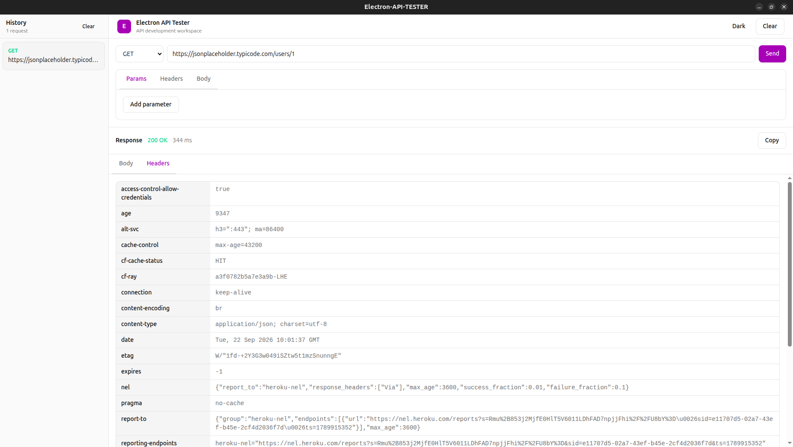

# Electron API Tester

A lightweight desktop API testing client built with Electron, React, TypeScript, and Tailwind CSS.

Electron API Tester provides a simple desktop workspace for sending HTTP requests, inspecting responses, and keeping request history locally.

## Demo



## Features

* GET, POST, PUT, PATCH, DELETE, and HEAD requests
* URL query parameters
* Custom request headers
* JSON request bodies
* Automatic JSON `Content-Type` handling
* Response status and duration
* Pretty-printed JSON responses
* Response headers viewer
* Copy response body
* Request history
* Persistent local request history
* Dark and light themes
* Desktop application for Linux, Windows, and macOS
* Typed Electron IPC between the renderer and main process

## Tech Stack

* Electron
* electron-vite
* React
* TypeScript
* Tailwind CSS
* Vite
* Electron Builder

## Downloads

Download the latest version from the [GitHub Releases](https://github.com/MalahimHaseeb/electron-api-tester/releases?utm_source=chatgpt.com) page.

### Linux

Two Linux packages are provided:

* `.AppImage` for a portable installation
* `.deb` for Debian and Ubuntu based distributions

For Ubuntu or Debian, download the `.deb` package from the latest GitHub Release and install it with:

```bash
sudo apt install ./electron-api-tester-0.1.0.deb
```

The AppImage can be downloaded and launched directly:

```bash
chmod +x electron-api-tester-0.1.0.AppImage
./electron-api-tester-0.1.0.AppImage
```

### Windows

Download the Windows `.exe` installer from the latest GitHub Release and run the installer.

### macOS

Download the `.dmg` file from the latest GitHub Release, open it, and move Electron API Tester to the Applications folder.

## Development

### Requirements

* Node.js 20+
* npm 10+

### Install dependencies

```bash
npm ci
```

### Start development

```bash
npm run dev
```

### Type check

```bash
npm run typecheck
```

### Build the application

```bash
npm run build
```

## Production Builds

Linux:

```bash
npm run build:linux
```

Windows:

```bash
npm run build:win
```

macOS:

```bash
npm run build:mac
```

Production artifacts are generated inside the `release/` directory.

## Project Structure

```text
src/
├── main/
│   ├── index.ts
│   └── ipc/
│       ├── app.ts
│       └── request.ts
├── preload/
│   ├── index.d.ts
│   └── index.ts
├── shared/
│   └── types.ts
└── renderer/
    ├── index.html
    └── src/
        ├── components/
        │   ├── history/
        │   ├── request/
        │   ├── response/
        │   └── ui/
        ├── styles/
        ├── App.tsx
        └── main.tsx
```

## Release Process

Releases are built automatically through GitHub Actions.

Creating a version tag triggers native builds for:

* Linux
* Windows
* macOS

The resulting installers are automatically attached to the GitHub Release.

## Repository

GitHub Repository: `github.com/MalahimHaseeb/electron-api-tester`

## License

This project is provided for personal and educational use.
